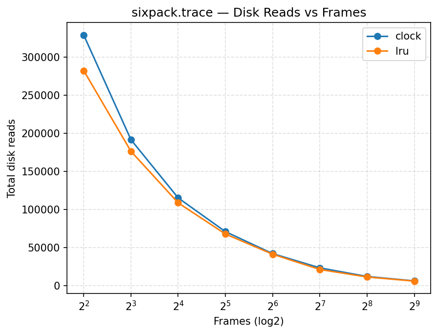

# Simulator Results (Auto-generated)

- memsim: `C:\Users\xurui\OneDrive\Desktop\OS-Assignment-2-main\memsim.py`
- traces: swim.trace, bzip.trace, gcc.trace, sixpack.trace
- frames: 4, 8, 16, 32, 64, 128, 256, 512
- algos: lru, clock

## Plots

### swim.trace

### bzip.trace

### gcc.trace

### sixpack.trace

